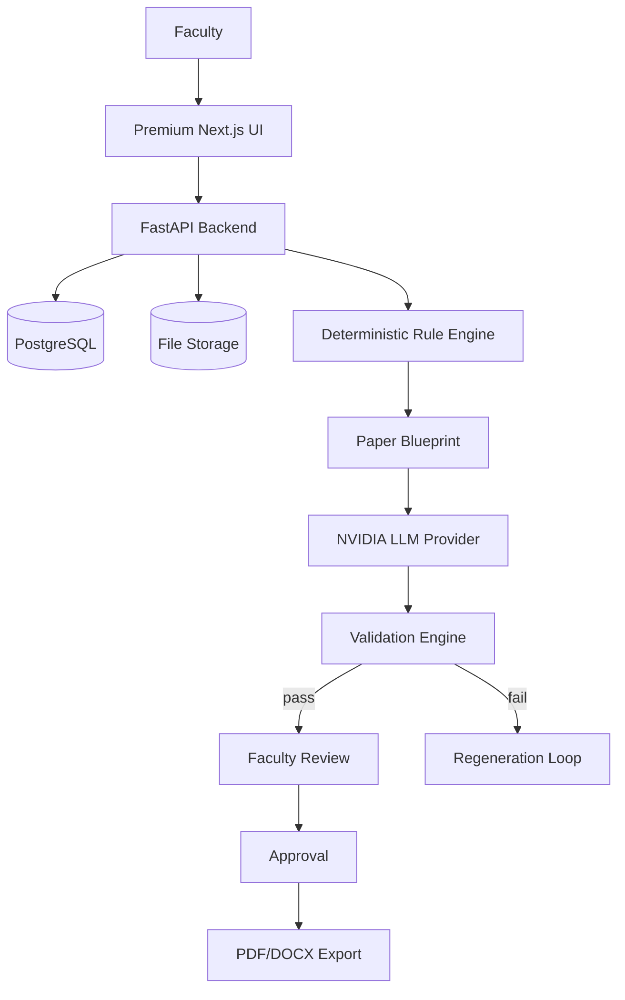

# Architecture

```mermaid
flowchart TD
  Faculty[Faculty] --> UI[Premium Next.js UI]
  UI --> API[FastAPI Backend]
  API --> DB[(PostgreSQL)]
  API --> Storage[(File Storage)]
  API --> Rules[Deterministic Rule Engine]
  Rules --> Blueprint[Paper Blueprint]
  Blueprint --> LLM[NVIDIA LLM Provider]
  LLM --> Validation[Validation Engine]
  Validation -->|pass| Review[Faculty Review]
  Validation -->|fail| Regenerate[Regeneration Loop]
  Review --> Approval[Approval]
  Approval --> Export[PDF/DOCX Export]
```

The backend owns academic rules. The LLM is only used for constrained language generation and semantic checks.
